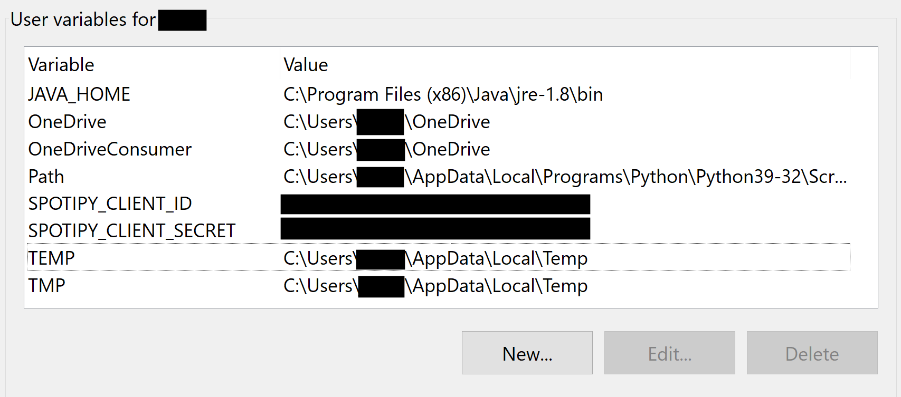

# volume-mixer
Websocket based adaptive volume mixer for Windows 10 with Python and HTML interface


### Features
- Change Volume of any Process live.  
- Works across Multiple Audio Interfaces, e.g Discord on a Seperate audio Interface.  
- As long as you can control the Volume in the Windows Volume mixer, this should be able to control it.  
- Live update of Processes.  
- Also extracts the Process Icon from the running .exe and uses it as Icon.  
- A Small (optional) Spotify Widget that Shows the Current Song, Artist, Album Art, Playing progress and Liked Status. You -can like/unlike a song by tapping on it.
(need to set up a Spotify App and Spotipy Credentials see their doc [here](https://spotipy.readthedocs.io/en/2.22.1/#quick-start))  

## Installation
+ Requires: Python >=2.7, !=3.0.*, !=3.1.*, !=3.2.*, !=3.3.*, !=3.4.*, <3.11 
+ Clone git repo
+ pip install -r requirements.txt
+ Update Config Variables (ip, port...) see [config.ini options](#configini-options)
  
### Setting up spotipy
Only needed if you want the Spotify Widget  
- Create a Spotify app, it needs the following permissions: user-read-currently-playing user-library-modify user-library-read  
- If you dont know how to create a spotify app and obtain your ID and Secret it's described [here](https://developer.spotify.com/documentation/web-api/concepts/apps)  
- Set them in as windows Env variables like :  
  


### Running the Websocket Server
python "Websocket Server\Server.py" on the Windows computer that you want to control
I recommend creating a bat file under "C:\Users\<yourname>\AppData\Roaming\Microsoft\Windows\Start Menu\Programs\Startup" so it autostarts
e.g
```
cd "C:\PythonVolCtrl\volume site\dev"
start pythonw VolCtrl4.1(Server).py
```
### Running the Python Gui
python "Python Gui\gui.py" on the device thats supposed to control the Windows volume mixer

### Running the HTML Gui
you will need to set up a virtualhost in Apache2.
placeholders that you need to replace with your own values:
+ \<websocketServerIp\> 
+ \<websocketServerPort\>
+ \<subPath\>
+ \<contentRoot\> path to the HTML Gui folder
```
<virtualhost *:80 or 443>
        ProxyRequests Off
        ProxyPreserveHost On

        DocumentRoot <contentRoot>

        # ProxyPass directives for WebSocket
        # Uncomment this if running on a domain
        #<Location /<subPath>>
        #        ProxyPass "ws://<websocketServerIp>:<websocketServerPort>"
        #        ProxyPassReverse "ws://<websocketServerIp>:<websocketServerPort>"
        #</Location>
</virtualhost>
```

### config.ini options
keep in mind the config.ini needs to be one folder above the python files so if the path to the python file is whatever/something/file.py the config.ini is expected to be at whatever/config.ini
| Key      | Value | Description |
| --------- | --------- | --------- |
|General|||
|enableSpotifyPlugin|True/False|Enables/Disables the Spotify plugin (only available in the python gui)|
|Python Gui|||
|turnScreenOffWithoutConnection|True/False|Attempts to turn off the Screen on Linux if the connection to the Websocket is not present|
|autoFullscreen|True/False|on launch will fullscreen the gui|
|hideCursor|True/False|hide Cursor, e.g in a touch environment|
|windowWidth|Number|pixel width of the gui window|
|windowHeight|Number|pixel height of the gui window|
|wssUrl|raw text|ws://ip:port or ws://hostname/subpath if using a reverse proxy|
|Websocket Server|||
|bindIp|ipv4 adress|the local ipv4 the Websocket Server will bind to|
|bindIp|port|the port the Websocket Server will bind to|
|spotipyRedirectUrl|raw text|callback url for spotipy authentication, set in your spotify app. e.g http://localhost:8080/callback|
|blacklist|raw text list|processes that should not be picked up by the volume mixer. format is as follows: blacklist = AMDRSServ.exe\nCLMgr.exe\nexplorer.exe|
